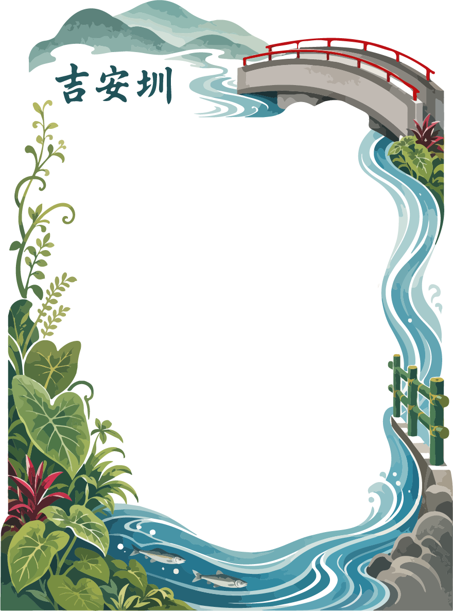

<html lang="zh-TW">
<head>
    <meta charset="UTF-8">
    <meta name="viewport" content="width=device-width, initial-scale=1.0">
    <title>~~吉安圳-不尽(盡)跌水井打卡點~~</title>
    
</head>
<body>

    <h2>吉安圳-不尽(盡)跌水井打卡點</h2>

    

        <video id="video" autoplay playsinline muted></video>
        
    

    <button id="toggleCamera">🔄 切換前後鏡頭</button>
    <button id="snap">📸 拍照</button>
    <button id="savePhoto">💾 照片儲存在下方 需長按儲存</button>

    <canvas id="canvas" style="display:none;"></canvas>
    
    

    
</body>
</html>
